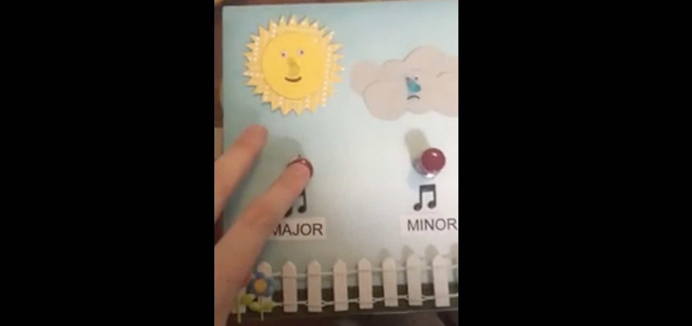

  

# Arduino Midterm Project

The repository for my midterm project for my Physical Computing class while an undergrad at the University of Miami.

The project creates a physical environment for music that is heard when a button is pressed.

## Code

This project was built using Processing, C++, and Arduino

## Contributors

- [@mackmilllr](https://twitter.com/mackmilllr) Coder
- [@zevensuy](https://twitter.com/Zevensuy) Advisor

## Additional Notes

MIDTERM PROJECT: Chord Quality Associations

As a music major, I've learned the hard way that the more you learn about different aspects of music (music theory, ear training, etc) at a younger age, the more it will pay off down the line if you chose to pursue a major and/or a career in music.

I've created a program to help young children begin having associations with chord qualities. The very basic chord qualities are major and minor, which are associated with happiness and sadness, respectively. By using this device, kids will hear a major chord-based song (Here Comes the Sun) and associate it will a happy, bright quality because the song only plays while the smiling sun's yellow LED nose lights up. For the children that can read, there is a label for "major" right next to the button for the sun- instead of just associating happy visuals with happy-sounding chords, these older kids can actually put the terms major and minor to use(logic: I press the button and Mr. Sun lights up with a happy song- this demonstrates the major quality). In the same way, kids can press the other button that is located under a frowning rain cloud to begin associations with minor chords. When the button is pressed, the frowning rain cloud has a blue lED that lights up and a minor-chord based song begins playing ("Bydlo" from Pictures at an Exhibition).

I think it is important to note that I was originally just going to play a chord instead of a little tune, but I thought it would be more interesting to the user and just as effective to use the whole song.

CODE PLAN

Logic: When the button located under the sun is pressed, a yellow LED lights up and a happy, major-quality tune plays. When the button located under the cloud is pressed, a blue LED lights up and a sad, minor-quality tune plays.

Pseudo code:
When button is pressed:
-turn LED on
-play music
When button is released:
-turn LED off
(song continues playing until end of clip)

THINGS I LEARNED

1) command line execution: with a little outside help, I was able to modify Len Shustek's Playtune program so that I could run it on my Mac and convert any midi file I wanted. This was made possible through his additional little program called "miditones". The file is translated into binary and coded into a version of C. Attached are the folders for both, with the code for the original examples, as well as the additional files(Beatles and Bydlo) that I converted.

2) momentary buttons are a thing: I thought all pushbutton switches were momentary. So when I began to have issues with running my program just from switching to a bigger button, I initially thought there was a problem with the code. It took me hours to figure out that it was the hardware (yikes). So I went to RadioShack's going out of business sale and grabbed most of their remaining buttons to test out different kinds and realized that momentary buttons were a thing. And now I have an endless button supply.

3) polyphony is possible: Many of the libraries I went through did NOT use more than one pin- all three pitches were programmed through one pin and polyphony was created by "cheating"- playing the three pitches in rapid succession of one another. The result? You could kind of hear the chord, but it was boring, very mechanical sounding, and annoying. The solution that Len Shustek brings us is programming each pitch on a different pin and hooking all three pins up to the speaker.

4) creating a user-friendly physical platform is tricky with an arduino.  
